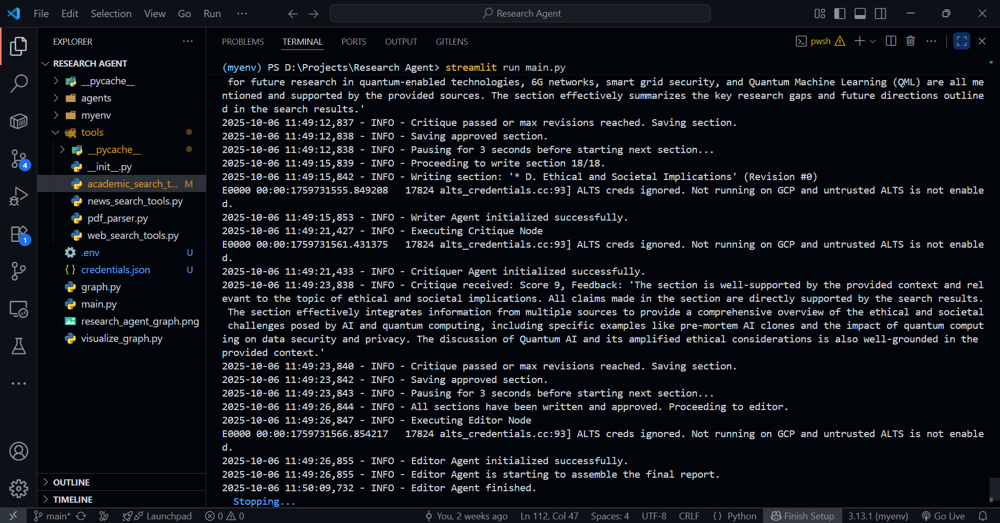
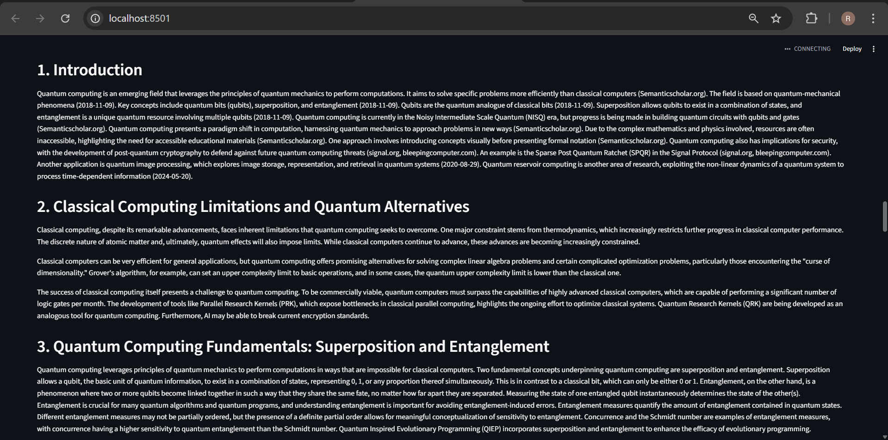
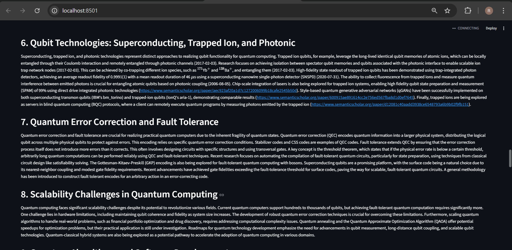

# A Multi-Agent System for Automated Research Report Generation

This project implements a sophisticated, autonomous AI research agent capable of producing comprehensive, multi-page reports on any given topic. The system is architected as a multi-agent collaboration, where specialized AI agents work together in a structured workflow orchestrated by LangGraph.

The agent leverages an Agent-to-Agent (A2A) communication pattern, allowing agents to critique and revise their work, iteratively improving the quality of the final output. This project demonstrates a complete, end-to-end agentic workflow, from initial planning and concurrent web research to content generation, critical review, and final report assembly.


*The simple Streamlit UI for kicking off the research process.*

---

## Project Structure

```
.
├── agents/
│   ├── planner.py      # Logic for the Planner Agent
│   ├── searcher.py     # Logic for the Searcher Agent
│   ├── writer.py       # Logic for the Writer Agent
│   ├── critiquer.py    # Logic for the Critiquer Agent
│   └── editor.py       # Logic for the Editor Agent
├── tools/
│   ├── web_search_tools.py # Functions for Tavily web search
│   ├── academic_search_tools.py # Functions for ArXiv & Semantic Scholar
│   └── news_search_tools.py   # Functions for NewsAPI
├── ss/
│   └── ...             # Screenshots for the README
├── .env                # File for API keys (not committed)
├── graph.py            # Defines the LangGraph agent workflow
├── main.py             # The main Streamlit application entrypoint
└── requirements.txt    # Project dependencies
```

---

## Key Features 🚀

* **🤖 Autonomous Multi-Agent System:** Utilizes a sophisticated team of AI agents (Planner, Searcher, Writer, Critiquer, Editor) who collaborate to produce the final report.
* **📚 Comprehensive & Concurrent Research:** Gathers information from a diverse set of sources, including general web search (**Tavily**), academic papers (**arXiv**, **Semantic Scholar**), and current events (**NewsAPI**). The Searcher agent uses asyncio to perform parallel searches across multiple data sources simultaneously (Tavily for web, ArXiv and Semantic Scholar for academic, and NewsAPI for current events).
* **🧠 Self-Correction & Quality Assurance:** Features an intelligent **critique-rewrite loop**. A dedicated Critiquer agent fact-checks and scores each written section, forcing the Writer agent to revise its work until it meets a quality threshold.
* **📄 Dynamic Report Generation:** From a single topic, the system dynamically generates a hierarchical outline, writes each section based on targeted research, and assembles everything into a final, polished Markdown document.
* **🌐 Interactive Web Interface:** A user-friendly front-end built with **Streamlit** allows for easy input and displays the agent workflow and final report in real-time.

---

## How It Works: The Agentic Workflow

The core of this project is a stateful graph built with **LangGraph**. Each node in the graph represents a specialized agent or a logical step. The state is passed from node to node, accumulating the data needed to build the final report.


*The flow of the multi-agent graph, from planning to the final report.*

### The Team of Agents

1.  **Planner Agent (`planner.py`)**
    * **Role:** The Architect.
    * **Action:** Takes the initial user topic and generates a detailed, hierarchical report outline (e.g., with 3-5 main sections and 2-4 subsections each). This outline serves as the blueprint for the entire operation.

2.  **Searcher Agent (`searcher.py`)**
    * **Role:** The Research Librarian.
    * **Action:** For *each section* in the outline, it runs a battery of concurrent searches using `asyncio` for maximum efficiency. It queries all available tools (Tavily, arXiv, etc.) to gather a rich, topic-specific context.

3.  **Writer Agent (`writer.py`)**
    * **Role:** The Technical Author.
    * **Action:** Receives the context for a *single section* and synthesizes it into a detailed, well-written paragraph. It is strictly instructed to ground all claims in the provided sources. If the context is insufficient, it has a robust fallback mechanism to write a general summary and flag it.

4.  **Critiquer Agent (`critiquer.py`)**
    * **Role:** The Peer Reviewer & Fact-Checker.
    * **Action:** This is the heart of the quality control loop. It receives the newly written section and the original search context. It then:
        * Scores the section from 1-10 on its factual grounding and relevance.
        * Provides specific, constructive feedback, pointing out every unsupported claim.
        * If the score is below 8, the report section is rejected and sent back to the Writer for revision, along with the critique.

5.  **Editor Agent (`editor.py`)**
    * **Role:** The Final Polisher.
    * **Action:** Once all sections have been written and approved, the Editor takes over. It assembles the sections in order, adds a main title and a table of contents, and performs a final proofread. Crucially, it also **standardizes formatting**, correcting inconsistent citations and rendering mathematical notation using LaTeX.

### The Self-Correction Loop in Action

The agent's ability to self-improve is clearly visible in the logs. When the Critiquer rejects a section, it triggers a revision cycle.



*An example from the logs where a section received a low score (7/10), was sent back for revision, and passed on the next attempt with a 9/10.*

---

## Tech Stack & Tools

* **Orchestration:** LangChain & LangGraph
* **LLM:** Google Gemini (via `langchain-google-genai`)
* **Web UI:** Streamlit
* **Search Tools:**
    * Tavily API (Web Search)
    * NewsAPI (News Articles)
    * Semantic Scholar API (Academic Papers)
    * ArXiv (Academic Papers via `langchain_community`)
* **Core Libraries:** `httpx`, `python-dotenv`, `asyncio`

---

## Setup and Installation

Follow these steps to get the project running locally.

### 1. Clone the Repository
```bash
git clone [https://github.com/your-username/your-repo-name.git](https://github.com/your-username/your-repo-name.git)
cd your-repo-name
```

### 2. Create and Activate a Virtual Environment
```bash
# For macOS/Linux
python3 -m venv venv
source venv/bin/activate

# For Windows
python -m venv venv
venv\Scripts\activate
```

### 3. Install Dependencies
Make sure you have a `requirements.txt` file. If not, create one from the active environment where you installed the packages.
```bash
# If you don't have a requirements.txt file, run this first:
# pip freeze > requirements.txt

pip install -r requirements.txt
```

### 4. Set Up API Keys
Create a file named `.env` in the root of your project and add your API keys. The project will not run without these.
```env
# Google Gemini API Key
GOOGLE_API_KEY="YOUR_GEMINI_API_KEY"

# Tavily Search API Key
TAVILY_API_KEY="YOUR_TAVILY_API_KEY"

# NewsAPI Key
NEWS_API_KEY="YOUR_NEWS_API_KEY"

# Semantic Scholar API Key (Optional but recommended to avoid rate limits)
SEMANTIC_SCHOLAR_API_KEY="YOUR_SEMANTIC_SCHOLAR_API_KEY"
```
> **Note:** For the Gemini API, you may need to enable billing on your Google Cloud project to avoid hitting the free tier's daily request limit, as this agent can be very active.

---

## How to Run the Application

With your virtual environment active and the `.env` file configured, start the Streamlit application with a single command:

```bash
streamlit run main.py
```

Open your web browser to the local URL provided by Streamlit (usually `http://localhost:8501`).

---

## Example Report Snippet

Here is an example of the quality and formatting of the final output generated by the agent:





> For example:
> 
> ### **Shor's Algorithm and its Implications for Cryptography**
> 
> Shor's algorithm is a significant quantum algorithm with the potential to factor large integers in polynomial time, offering an exponential speedup compared to classical algorithms [arXiv]. This capability poses a threat to modern encryption techniques such as RSA, which rely on the difficulty of factoring large numbers [semanticscholar.org]. However, implementing Shor's algorithm requires a substantial number of qubits, presenting a challenge in the Noisy Intermediate-Scale Quantum (NISQ) era [arXiv]. Research efforts are focused on reducing the resource requirements of Shor's algorithm, including the development of distributed phase estimation algorithms that reduce the number of qubits needed on a single node. For example, one such algorithm reduces the qubit requirement by $(2 - 2/k)L - \log_2(k) - O(1)$ when factoring an $L$-bit integer using $k$ compute nodes [arXiv].
